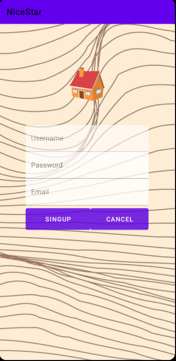
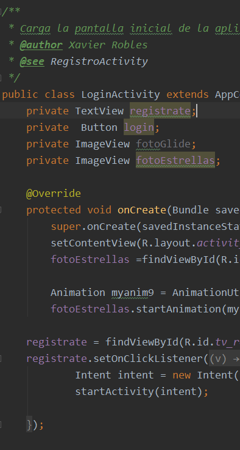

# NiceStart
<b style="color:white">Splash</b> | <b style="color:white">login</b> | <b style="color:white">Main1</b>
-------|-------|-------
![] | ![] | ![]

<b>Splash</b> y el <b>login</b> son la <b style="color:Black">principales pantallas</b> de nuestra aplicacion cagra una pequeña animacion

<b style="color:white">Registro</b> | <b style="color:white">Main2</b> | <b style="color:white">Code</b>
-------|-------|-------
 |  | ![]