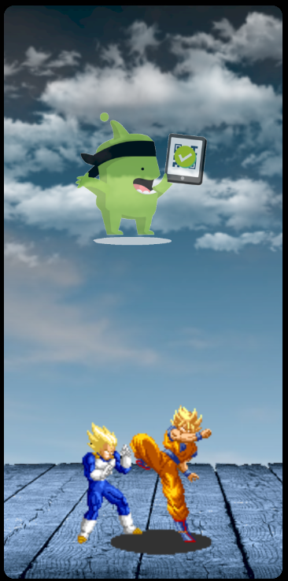
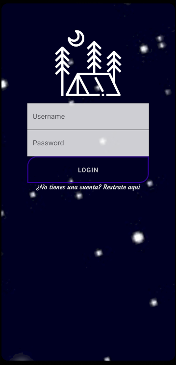
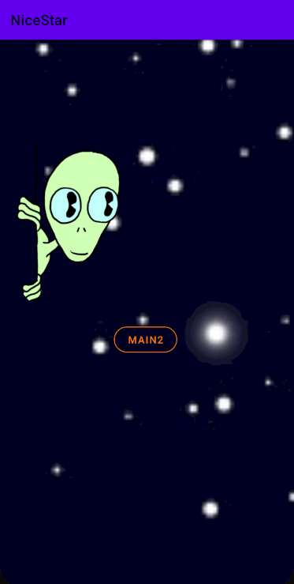

# NiceStart
<b style="color:white">Splash</b> | <b style="color:white">login</b> | <b style="color:white">Main1</b>
-------|-------|-------
 |  | 
<b>Splash</b> y el <b>Login</b> son la <b style="color:Black">principales pantallas</b> de nuestra aplicacion carga una pequeña animacion
<b style="color:white">Registro</b> | <b style="color:white">Main principal</b> | <b style="color:white">Menu al mantener pulsado</b>
-------|-------|-------
 |  | 
<b>Registro</b> para nuevos usuarios, <b>Menu principal</b> son la <b style="color:Black">donde ya se puede ver gran variedad de la funcionabilidad</b>
<b style="color:white">Appbar menu</b> | <b style="color:white">Perfil</b> | <b style="color:white">Deplegable</b>
-------|-------|-------
 |  | 
<b>Appbar es donde podemos elegir la opciones del menu el perfil o deplegar la tarjeta de usuario</b>, <b>Perfil es donde salen todos los link del usuario y los carga en pantalla</b> <b style="color:Black">Carga una tarjeta con el nombre del usuario</b>
<b style="color:white">menu 2</b> | <b style="color:white">Barra de navegacion</b> | <b style="color:white">Demo</b>
-------|-------|-------
 |  | 

 |  | 
